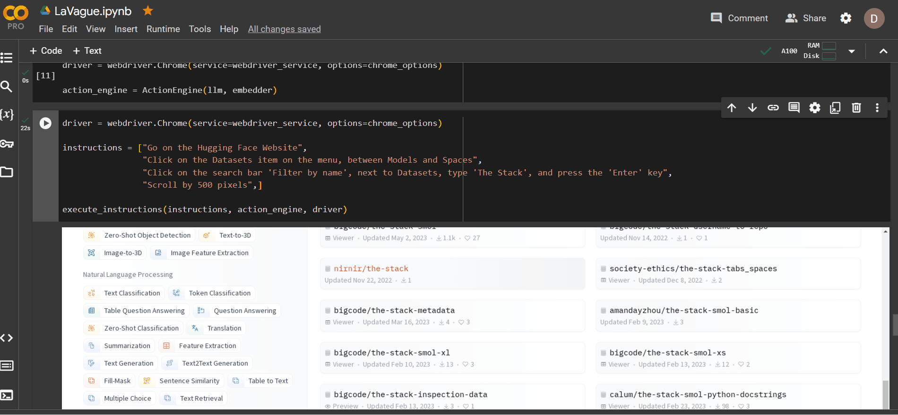
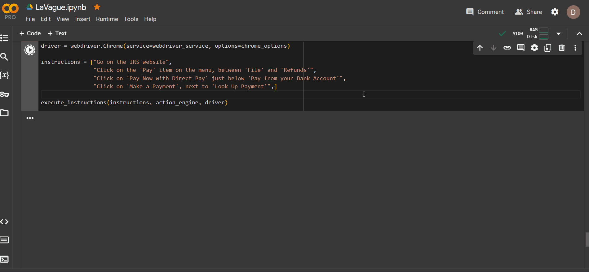

  
  <h1>🌊 Welcome to LaVague</h1>
  
Redefining internet surfing by transforming natural language instructions into seamless browser interactions.

  <h2>See LaVague in Action</h2>
  
Here are examples to show how LaVague can execute natural instructions on a browser to automate interactions with website:

  <figure>
    
    <figcaption>LaVague interacting with Hugging Face's website.</figcaption>
  </figure>
  <figure>
    
    <figcaption>LaVague interacting with the IRS's website.</figcaption>
  </figure>

## Motivations

LaVague is designed to automate menial tasks on behalf of its users. Many of these tasks are repetitive, time-consuming, and require little to no cognitive effort. By automating these tasks, LaVague aims to free up time for more meaningful endeavors, allowing users to focus on what truly matters to them.

By providing an engine turning natural language queries into Selenium code, LaVague is designed to make it easy for users or other AIs to automate easily express web workflows and execute them on a browser.

One of the key usages we see is to automate tasks that are personal to users and require them to be logged in, for instance automating the process of paying bills, filling out forms or pulling data from specific websites. 

LaVague is built on open-source projects and leverages open-sources models, either locally or remote, to ensure the transparency of the agent and ensures that it is aligned with users' interests.

## Features

- **Natural Language Processing**: Understands instructions in natural language to perform browser interactions.
- **Selenium Integration**: Seamlessly integrates with Selenium for automating web browsers.
- **Open-Source**: Built on open-source projects such as transformers and llama-index, and leverages open-sources models, either locally or remote, to ensure the transparency of the agent and ensures that it is aligned with users' interests. 
- **Advanced AI techniques**: Uses a local embedding (``bge-small-en-v1.5``) to first perform RAG to extract the most relevant HTML pieces to feed the LLM answering the query, as directly dropping the full HTML code would not fit in context. Then leverages Few-shot learning and Chain of Thought to elicit the most relevant Selenium code to perform the action without having to finetune the LLM (``Nous-Hermes-2-Mixtral-8x7B-DPO``) for code generation.

## Getting Started

**Pre-requisites**: To have a fast and low-cost experience, we will use [Hugging Face Inference for PRO users](https://huggingface.co/blog/inference-pro). 
You can swap the call to the ``Nous-Hermes-2-Mixtral-8x7B-DPO`` model available on Inference API with a small local model, but it might be more involved and require fine-tuning.

You will need a Hugging Face Hub Token to use the ``Nous-Hermes-2-Mixtral-8x7B-DPO`` model from the . You can get one by signing up on the [Hugging Face Hub](https://huggingface.co/join).

You can try LaVague in the following Colab notebook:

## Roadmap

This is an early project but could grow to democratize transparent and aligned AI models to undertake actions for the sake of users on the internet.
We see the following key areas to explore:
- Fine-tune a smaller model like a ``gemma-7b-it`` to be expert in Text2Action and run locally (current tests failed) 
- Improve retrieval to make sure only relevant pieces of code are used for code generation
- Support other browser engines or even other automation frameworks

## Contributing

This is a one-man project done during a hackathon for now, so if you are interested please ping me on [Twitter](https://twitter.com/dhuynh95)!