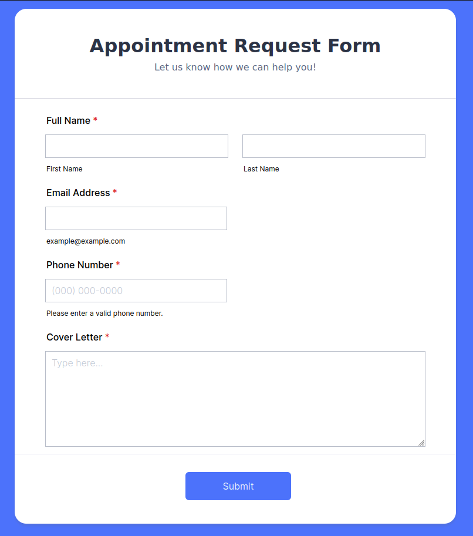
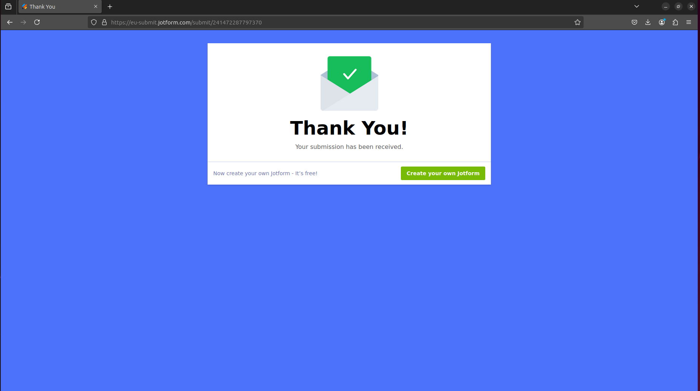

# Fill out forms

LaVague can be used to fill out simple forms automatically. You can provide the necessary information to complete the form and assign LaVague Agents with an objective to fill event registration forms, job applications, etc. 

We have created a [sample job application form](https://form.jotform.com/241472287797370) you can use to test this use case. 



## Try it yourself

After [installation](../get-started/quick-tour.md), create a new .py file and run this code to try LaVague with Notion!

!!! note "API key"
      
      For this example to work, make sure you have your `LAVAGUE_API_KEY` set in your environment.

```python
from lavague.core.agents import WebAgent

agent = WebAgent()
url = "https://form.jotform.com/241472287797370"

data = """
- job: product lead
- first name: John
- last name: Doe
- email: john.doe@gmail.com
- phone: 555-123-4567
- cover letter: Excited to work with you!
"""

obj = "Use the necessary data provided to fill in the form."
agent.run(url=url, objective=obj, user_data=data)

# Show screenshot after running LaVague
from PIL import Image
img = Image.open(agent.screeshots["after"])
img.show()
```


