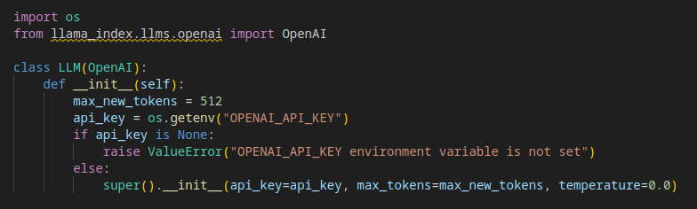
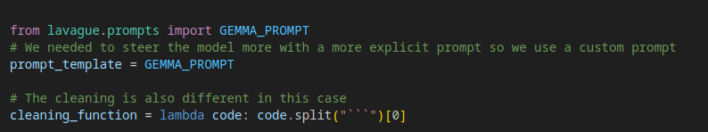
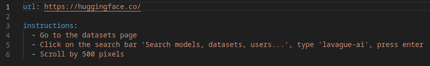

# Customization

In the [quick tour](./quick-tour.ipynb), we saw how to use LaVague with our default config file for OpenAI - we also provide default config files for several other [integrations](../integrations/api/azure-openai.ipynb). In this guide, we will show you how you can modify these config files or create your own for customized use cases.

## Python config file

### Customizable elements

In the Python configuration file, we can customize the following 5 elements:

- `llm`: The `LlamaIndex` LLM to be used to generate the automation code by the `ActionEngine`
- `embedder`: A `LlamaIndex` embedding model to be used by the `ActionEngine` to perform RAG to extract the most relevant HTML source code pieces to feed the LLM answering the query
- `prompt_template`: The prompt template to be used to query the LLM to generate the relevant automation code
- `cleaning_function`: A function used to clean the LLM output to ensure it is code ready to be executed by the `CommandCenter`
- `get_driver`: A `selenium.webdriver` to be used to execute our Selenium automation code

In the `openai_api.py` default config file, we only provide a new `llm` value, meaning all other values will use our defaults.

Meanwhile, for our local `DeepSeek Coder` integration, we also provide a custom prompt and cleaning function, required for good performance with this integration.

### Using your custom config file

You can go ahead and customize one of our default config files by adding new values for any of these elements within the file, or create your own and then provide it as the `config_path` file when using our CLI tool:

`lavague -i huggingface.yaml -c custom_file.py launch`

### Default values

Our default values are:

- `LLM`: OpenAI's `GPT3.5`
- `embedder`: LlamaIndex's default `OpenAIEmbedding`
- [prompt_template](https://github.com/lavague-ai/LaVague/blob/main/src/lavague/prompts.py)
- [get_driver](https://github.com/lavague-ai/LaVague/blob/cb66a8de9e1210c95ef34df35254ce6875aa69eb/src/lavague/defaults.py#L29)
- [cleaning_function](https://github.com/lavague-ai/LaVague/blob/cb66a8de9e1210c95ef34df35254ce6875aa69eb/src/lavague/action_engine.py#L15)

## Instructions yaml file

### Custom URL and instructions

When we use the CLI commands, we also provide a instuctions yaml file to the `file_path` option: 
`lavague -i huggingface.yaml -c custom_file.py launch`

Let's take a look at the default `huggingface.yaml` file we provide:

The file has two key-pair values defined:

`url`: Here we place the URL of the website we wish to perform automated actions on. You can change this to any website you like.

`instructions`: Here we place our instructions. Again, you can change these to whatever you like.

In `launch` mode, these instructions will appear as individual clickable suggestions in the interactive Gradio demo. We provide three instructions in our default file, but you can provide more or less instructions if you like.

In `build` mode, the code generated can be executed to perform all of the instructions you provide in your instructions file, performing one after the other as a sequence of actions.