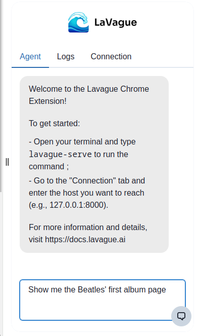
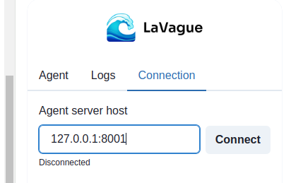
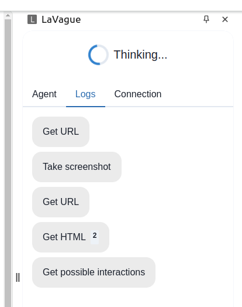

# LaVague Chrome Extension

## Getting started with the LaVague Extension

The LaVague Chrome Extension enables you to automate web navigation using LaVague Agents directly in your browser.

It is made up of two key components:

- The [Chrome extension](https://chromewebstore.google.com/detail/lavague/johbmggagpndaefakonkdfjpcfdmbfbm) which you can install from the Chrome Web Store.
- The `lavague-server` package & CLI tool, which enable you to launch the Agent that will be used by the extension.

<iframe width="560" height="315" src="https://www.youtube.com/embed/O8CMSdj1a28" frameborder="0" allow="accelerometer; autoplay; clipboard-write; encrypted-media; gyroscope; picture-in-picture" allowfullscreen></iframe>

### Install necessary packages

You will firstly need to install the following lavague package:

```shell
pip install lavague-server
```

You will also need to make sure your `OPENAI_API_KEY` is set in your current environment.

### Running the LaVague Chrome Extension server

Before you can use the LaVague Chrome Extension in your browser, you will need to launch our `AgentServer`, which will launch our default Agent which uses OpenAI's `gpt-4o`.

🚀 The fastest way to do this is using our CLI command:

```bash
lavague-serve
```

> This server will need to be running whenever you want to use the extension.

!!! hint "Ports"
    Note, by default this will launch our Agent Server on pot `8000`. You can change this by using the `-p` or `--port` option followed by the port of your choice:
    
    ```bash
    lavague-server 8001
    ```

### Using the extension

Now you're ready to install and interact with the LaVague browser extension directly in your Chrome navigator.

You can install the extension [here](https://chromewebstore.google.com/detail/lavague/johbmggagpndaefakonkdfjpcfdmbfbm).

Once the extension is installed, you can navigate to the website you want to use your LaVague agent on and open the extension via the Chrome `Extensions` menu (a 🧩 shortcut is usually visible on the top right, next to the URL navigation bar).

From there, if have launched your Agent Server using the default port, you can directly input your `objective` into the chat interface to start using your Agent.



If you are using a custom port, you can click on the `connection` tab to manually modify the port and connect to your `Agent Server`.



You will see the Agent's thoughts, internal step-by-step instructions & any output in the chat interface.

For more detailed step-by-step information, you can see the `logs` tab.



## Customizing your Agent

If you want to modify your LaVague Chrome extension Agent, for example, so that it runs using Anthropic models instead of OpenAI models, you will need to launch your Agent Server using our Python library, which is more customizable than our CLI tool.

To do this, you will need to create an instance of AgentServer, passing it your own custom function which must:

- accept a `session` argument of type `AgentSession`
- return a `WebAgent`

The WebAgent can be built and customized just like we do in the rest of the LaVague framework.

For more information on customizing LaVague Agents, see our [customization guide](./customization.md)

```py
from lavague.core import WorldModel, ActionEngine
from lavague.core.agents import WebAgent
from lavague.server.driver import DriverServer
from lavague.server import AgentServer, AgentSession
from llama_index.multi_modal_llms.anthropic import AnthropicMultiModal

def create_agent(session: AgentSession):

    # Use custom multi-modal model
    anthropic_mm_llm = AnthropicModal(model="claude-3-sonnet-20240229", max_tokens=3000) 
    world_model = WorldModel(mm_llm=anthropic_mm_llm)

    driver = DriverServer(session)
    action_engine = ActionEngine(driver)
    return WebAgent(world_model, action_engine)

server = AgentServer(create_agent)
server.serve()
```

## LaVague Chrome Extension from local

To interact with a locally modified version of the extension, you'll need to take some additional steps.

### 1. Setup

`yarn` or `npm install`

### 2. Build or run

You can build the project with:
`yarn build` or `npm run build`

This will build the project as a minified production build.

You can run the project with:
`yarn dev` or `npm run dev`

This will allow the extension built files to be updated in real time when changes are made in the code using `watch mode`.

### 3. Upload your local Chrome Extension

Finally, you can upload and test your locally modified Chrome extension by doing the following:

-   Go to the Extensions page [chrome://extensions/](chrome://extensions/)
-   Click the `Load unpacked` button
-   Select the `dist` directory

The extension has now been successfully installed. Every time you update the extension code, click the refresh button on the LaVague extension.

### 4. Launch the LaVague Chrome Extension server

You can now launch your `Agent Server` using either the CLI or Python library as described above.

You will now be able to interact with your modified version of the LaVague extension in your Chrome navigator.

### 5. Contributing to the LaVague Chrome Extension package

If you think your changes to our Extension can improve our package, please feel free to open a PR so we can review your suggested updates! To learn more about how to contribute to LaVague, see our [contribution guide](../contributing/general.md).