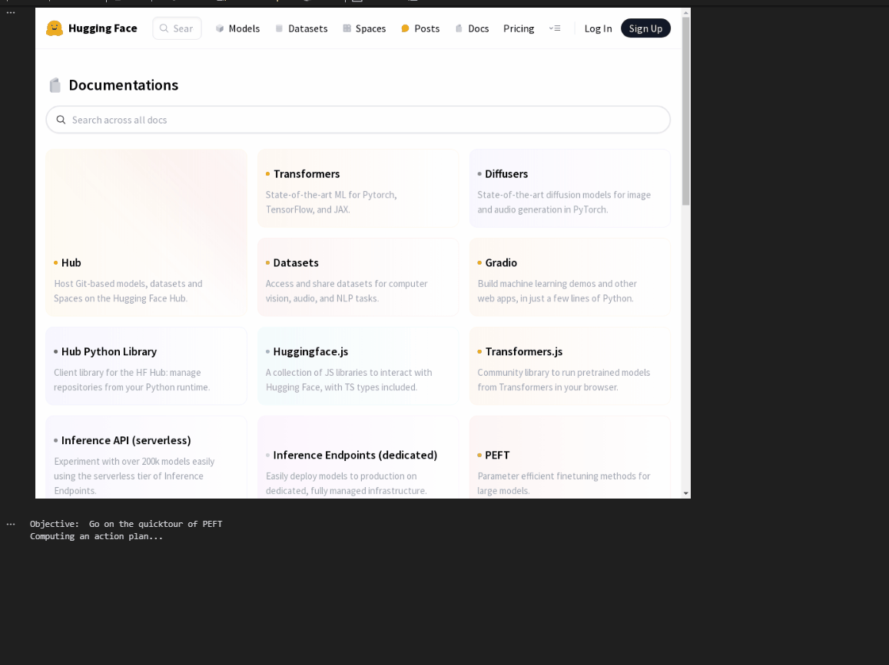

# Quick Tour

<a target="_blank" href="https://colab.research.google.com/github/lavague-ai/LaVague/blob/main/docs/docs/get-started/quick-tour-notebook/quick-tour.ipynb">
</a>

!!! tips "Pre-requisites"

    - We use OpenAI's models, for the embedding, LLM and Vision model. You will need to set the OPENAI_API_KEY variable in your local environment with a valid API key for this example to work.

    If you don't have an OpenAI API key, please get one [here](https://platform.openai.com/docs/quickstart/developer-quickstart)

    - Our package currently only supports python versions 3.10 or greater. Please upgrade your python version if you are using a version below this.

## Installation

We start by downloading LaVague.

```bash
pip install lavague
```

!!! tip "OPENAI_API_KEY"
    If you haven't already set a valid OpenAI API Key as the `OPENAI_API_KEY` environment variable in your local environment, you will need to do that now.

## Full code example

Here is a full code example to create and run your agent using LaVague.

We will go over what is happening in this code in the following sections below.

```python
# Install necessary elements
from lavague.drivers.selenium import SeleniumDriver
from lavague.core import ActionEngine, WorldModel
from lavague.core.agents import WebAgent

# Set up our three key components: Driver, Action Engine, World Model
driver = SeleniumDriver(headless=False)
action_engine = ActionEngine(driver)
world_model = WorldModel()

# Create Web Agent
agent = WebAgent(world_model, action_engine)

# Set URL
agent.get("https://huggingface.co/docs")

# Run agent with a specific objective
agent.run("Go on the quicktour of PEFT")
```



You can also use LaVague to launch an interactive Gradio interface for using the agent with the `agent.demo()` method.

```python
# We should set no_load_strategy to True when using the demo() method
driver = SeleniumDriver(headless=True, no_load_strategy=True)
action_engine = ActionEngine(driver)
world_model = WorldModel()

# Create Web Agent
agent = WebAgent(world_model, action_engine)

# Set URL
agent.get("https://huggingface.co/docs")

# Launch the agent in the Agent Gradio Demo mode
agent.demo("Go on the quicktour of PEFT")
```

!!! note "Gradio Agent Demo no_load_strategy"
    For faster performance when using the `agent.demo()` method, you should set the `no_load_strategy` Driver option to True.

    This turns off Selenium's default load strategy that waits for the page to be fully loaded before giving you back control which was causing a significant slowdown with our `Gradio Agent Demo`. Instead, LaVague will detect when the page is loaded.

    This option is not recommended with the `agent.run()` method however.

You can take a quick look at the `demo` feature in the video below:

<figure class="video_container">
  <video controls="true" allowfullscreen="true">
    <source src="https://github.com/lavague-ai/LaVague/blob/main/docs/assets/gradio.webm?raw=true" type="video/webm">
  </video>
</figure>

## Key components explained

### Driver

The Driver component is used to perform actions on web browsers and get information about our current web page.

We currently provide a Selenium Driver component by default, as well as a Playwright Driver option.

!!! tip "Avoiding issues around logins"
    You may experience difficulties using LaVague for logins due to bot protections.

    Here are a couple of tips to avoid these issues when using LaVague:

    ### Manual login

    By creating a driver in non-headless mode, with the option `headless=False`, you can manually log into the website in your driver's browser window after launching it with the `agent.get(URL)` command.

    You can enforce a delay before your program runs the next command by using `time.sleep()` with the `time` package.

    Then you can continue using the session, now logged into your site, with the `agent.run(OBJECTIVE)` commands.

    ### 🍪 Plugging in an existing browser session

    Alternatively, you can use LaVague with your usual browser session to leverage your session's remembered logins. To do this, you need to add the path to your Chrome profile directory as an argument to `user_data_dir` when initializing your browser. 
    
    If not supplied, Chrome starts a fresh session.

For more information on the Driver component see our [Driver module guide](../learn/browser-drivers.md)

### Action Engine

Next up, let's consider the Action Engine component. This component receives a natural language text instruction and generates the action needed to carry out this instruction. 

In our example, the Action Engine will perform RAG and generates the code for the action using the default embedding and Large Language Models (OpenAI's text-embedding-3-large & GPT-4o). 

To create an Action Engine with a different `LLM` and `embedding model` you can pass any any `LlamaIndex Embedding` or `LlamaINDEX llm` object` as arguments to your Action Engine, for example:

```python
from llama_index.embeddings.huggingface import HuggingFaceEmbedding
from llama_index.llms.groq import Groq

llm = Groq(model="mixtral-8x7b-32768")

embedding = HuggingFaceEmbedding(
    model_name="BAAI/bge-small-en-v1.5"
)

action_engine = ActionEngine(driver=driver, llm=llm, embedding=embedding)
```

To find out more about the Action Engine and how to use custom models see our [Action Engine guide](../learn/action-engine.md) or [customization guide](./customization.md).

### World Model

The World Model is responsible for converting the user's global objective into the next instruction for the Action Engine to carry out based on visual and textual information.

The World Model uses a multi-modal model to do this conversion. We use GPT-4o by default, but you can replace the multi-modal LLM with any `LLamaIndex multi-modeal LLM` when initializing your World Model with the following code:

```python
from llama_index.multi_modal_llms.gemini import GeminiMultiModal

mm_llm = GeminiMultiModal(model_name="models/gemini-1.5-pro-latest"),

world_model = WorldModel(mm_llm=mm_llm)
```

To find out more about the World Model, see our [World Model guide](../learn/world-model.md), and for more information on using custom models, see our [customization guide](./customization.md).

### Web Agent

The Web Agent brings all of these components together and can be used to perform tasks defined by our `objective` argument with the `run` method or to launch an interactive interface with Gradio with our `demo()` mode.

## Learn

To learn more about the LaVague architecture and workflow, head to the [learn section in our docs](../learn/architecture.md)!
