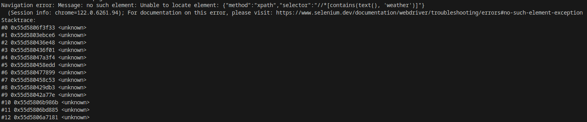

# Troubleshooting common issues

## Popups (logins, cookies, CAPTCHA, etc.)

A common problem users can have when using LaVague is a failure to get past website pop-ups such as CAPTCHA, accepting cookies or logging in. While we are working on improving our agents' abilities to deal with pop-ups, we recommend the following two possible solutions:

#### 🍪 Plugging in an existing browser session

When you run LaVague without a `user_data_dir`, a blank Chrome session is started, with no access to your usual logins, cookies preferences, etc.

However, you can change this and plug in your usual browser session with the following code:

```python
from lavague.drivers.selenium import SeleniumDriver
driver = SeleniumDriver(headless=False, user_data_dir="/home/<YourUsername>/.config/google-chrome")
```

This will avoid you needing to log in again or re-submit cookies preferences etc. on sites you already use, which can greatly reduce the likelihood of popups causing issues when using LaVague.

??? hint "User_data_dir path"
    You will need to substitute the path supplied to the `user_data_dir` with the correct path for your browser profile. 
    
    Here are the default paths on Windows, Linux and OSX:

    - **Windows**: `C:\Users\<YourUsername>\AppData\Local\Google\Chrome\User Data`
    - **Linux**: `/home/<YourUsername>/.config/google-chrome`
    - **OSX**: `/Users/<YourUsername>/Library/Application Support/Google/Chrome`

#### Manual interactions for pop-ups

When using a driver in non-headless mode, you can manually take actions on that webpage. Where you know you will need to login to a site or accept cookies for example, you can manually add a pause in your code to allow you time to manually accept cookies or log in:

```python
agent.get("https://www.bbc.co.uk")

import time
time.sleep(5)
time.sleep(5)

agent.run("What is the weather in Birmingham")
```

## WebDriver exceptions

If you have errors in your trace relating back to `selenium.common.exceptions` and `DevToolsActivePort`, this should be due to errors using the Selenium Web Driver in your environment. 

An example of a common Selenium error would be:

```code
selenium.common.exceptions.SessionNotCreatedException: Message: session not created: Chrome failed to start: exited normally.
(session not created: DevToolsActivePort file doesn't exist)
(The process started from chrome location /home/user/.cache/selenium/chrome/linux64/126.0.6478.55/chrome is no longer running, so ChromeDriver is assuming that Chrome has crashed.)
```

#### Environment without GUI support

The error above was caused by running LaVague in non-headless mode in an environment without GUI support.

If you are using an environment without GUI support, you will need to ensure your driver is set to `headless` mode with the following code:

```python
driver = SeleniumDriver(headless=True)
```

When using `headless` mode, you can activate a `display` mode to display real-time updated screenshots of the agent's progress. This works well in Google Colab.

```python
agent.run("Print out the name of this week's top trending model", display=True)
```

??? note "Running LaVague on Windows Subsystem for Linux 1"

    LaVague may be incompatible with WSL1 due to its compatibility issues with GUI applications.
    
    This can be resolved by [updating to WSL2](https://learn.microsoft.com/en-us/windows/wsl/tutorials/gui-apps).

??? note "Running LaVague with replit.com"

    To get LaVague working in a `replit.com` environment, you will need to add the following packages to the replit.nix file:

    ```code
    {pkgs}: {
    deps = [
        pkgs.geckodriver
            pkgs.python38Full
            pkgs.chromium
            pkgs.chromedriver
    ];
    }
    ```

    > To access the replit.nix file, you'll need to click on `show hidden files`.

    Then you can use LaVague with the Selenium Driver set to headless mode.

    ```python
    from lavague.core import  WorldModel, ActionEngine
    from lavague.core.agents import WebAgent
    from lavague.drivers.selenium import SeleniumDriver
    import os
    my_secret = os.environ['OPENAI_API_KEY']
    selenium_driver = SeleniumDriver(headless=True)
    world_model = WorldModel()
    action_engine = ActionEngine(selenium_driver)
    agent = WebAgent(world_model, action_engine)
    agent.get("https://huggingface.co/docs")
    ret = agent.run("What is the top model?")
    print(ret.output)
    ```

    Make sure to add `lavague` to your dependencies list in your pyproject.toml.
    
    ```code
    [tool.poetry.dependencies]
    python = ">=3.10.0,<3.12"
    lavague = ">=1.1.3"
    ```
    
## Navigation errors

Another common issue some users face is `Navigation errors`:



These errors mean that the Navigation Engine did not successfully generate the correct Selenium code needed to interact with the element of the web page needed to achieve its instruction.

There can be several reasons for this and this can often be fixed by modifying options relating to the World Model, Retriever or Action Engine. 

For a guide on how to debug navigation errors, see our debugging guide (**coming soon**).