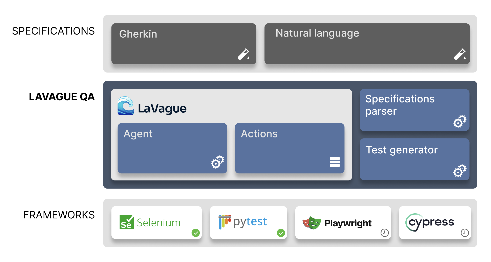

# QA Automation with LaVague

!!! warning "Early release"
    LaVague QA is still a work in progress and may contain bugs. Join our [community of amazing contributors](https://discord.gg/invite/SDxn9KpqX9) to help make this tool more reliable!

## Introduction

LaVague QA is a command-line tool that turns Gherkin test specifications into ready-to-use Pytest code for web applications. Built on the LaVague open-source framework, it automates the creation and maintenance of automated tests.

See it in action generating tests on Amazon: 
<iframe width="100%" height="315" src="https://www.youtube.com/embed/5X4S2ed4QqA" frameborder="0" allow="accelerometer; autoplay; clipboard-write; encrypted-media; gyroscope; picture-in-picture" allowfullscreen></iframe>


### Key Benefits
- **Faster test creation:** generate Pytest code directly from test scenarios by leveraging LaVague Agents.
- **Reduced maintenance:** AI element selection adapts to UI changes, lowering the upkeeping needed when the site changes.

### How it works

1. Write test scenarios in natural language using Gherkin.
2. Run LaVague QA to automatically generate the corresponding Pytest code.
3. Execute tests or regenerate them as your website evolves.




## Example
<a target="_blank" href="https://colab.research.google.com/github/lavague-ai/LaVague/blob/main/lavague-qa/demo_lavague_QA.ipynb">
</a>


### Install LaVague QA

```bash
pip install lavague-qa
```

!!! warning "API keys"
    LaVague QA uses `gpt-4o` models by default, as such, you will need to define `OPENAI_API_KEY` as an environment variable before running LaVague. 

### Define feature file
In this example, we will use an example feature file that adds test coverage for Cart item removal, a critical component of the Amazon Cart feature.

```gherkin
Feature: Cart

  Scenario: Add and remove a single product from cart
    Given the user is on the homepage
    When the user clicks on "Accepter" to accept cookies
    And the user enters "Zero to One" into the search bar and press Enter
    And the user clicks on the first product in the search results
    And the user clicks on the "Ajouter au panier" button
    And the confirmation message is displayed
    And the user clicks on "Aller au panier" under "Passer la commande"
    And the user clicks on "Supprimer" from the cart page
    Then the cart should be empty
```

You can view the example file [here](https://raw.githubusercontent.com/lavague-ai/LaVague/main/lavague-qa/features/demo_amazon.feature) or download it with following command:

```bash
wget https://raw.githubusercontent.com/lavague-ai/LaVague/main/lavague-qa/features/demo_amazon.feature
```

> For guidelines on how to create a Gherkin feature file, see [this guide](https://cucumber.io/docs/gherkin/reference/).

### Use the CLI

Use `lavague-qa` with a `URL` and a `.feature` file.


```bash
lavague-qa --url https://www.amazon.com --feature ./demo_amazon.feature
```

By default, LaVague QA uses:

- Graphical UI for the browser, use `--headless` or `-h` to **run in headless mode**. 
- GPT4 models, use the `--context` or `-c` flag with your custom set of LLMs. 

This will generate `demo_amazon.py`, a Pytest file implementing all steps in your Gherkin scenario.

??? note "Example `demo_amazon.py`"
    `demo_amazon.py` 
    ```py
    import pytest
    from pytest_bdd import scenarios, given, when, then, parsers
    from selenium import webdriver
    from selenium.webdriver.common.by import By
    from selenium.webdriver.support.ui import WebDriverWait
    from selenium.webdriver.support import expected_conditions as EC
    from selenium.common.exceptions import ElementClickInterceptedException
    import time

    # Constants
    BASE_URL = 'https://www.amazon.fr/'

    # Scenarios
    scenarios('demo_amazon.feature')

    # Fixtures
    @pytest.fixture
    def browser():
        driver = webdriver.Chrome()
        driver.implicitly_wait(10)
        yield driver
        driver.quit()

    # Steps
    @given('the user is on the homepage')
    def user_on_homepage(browser):
        browser.get(BASE_URL)

    @when('the user clicks on "Accepter" to accept cookies')
    def accept_cookies(browser):
        accept_button = WebDriverWait(browser, 10).until(
            EC.element_to_be_clickable((By.XPATH, "/html/body/div/span/form/div[2]/span/span/input"))
        )
        accept_button.click()

    @when(parsers.parse('the user enter "{search_term}" into the search bar and press Enter'))
    def enter_search_term(browser, search_term):
        search_input = WebDriverWait(browser, 10).until(
            EC.presence_of_element_located((By.XPATH, "/html/body/div/header/div/div/div[2]/div/form/div[3]/div/input"))
        )
        search_input.send_keys(search_term)
        search_input.submit()

    @when('the user click on the first product in the search results')
    def click_first_product(browser):
        first_product_link = WebDriverWait(browser, 10).until(
            EC.element_to_be_clickable((By.XPATH, "/html/body/div/div/div/div/div/span/div/div[2]/div/div/span/div/div/div[2]/div/h2/a"))
        )
        first_product_link.click()

    @when('the user click on the "Ajouter au panier" button')
    def add_to_cart(browser):
        add_to_cart_button = WebDriverWait(browser, 10).until(
            EC.element_to_be_clickable((By.XPATH, "/html/body/div[2]/div/div[4]/div/div[5]/div[4]/div[4]/div/div/div/div/div/div/div/div/div[2]/div/form/div/div/div[23]/div/span/span/span/input"))
        )
        add_to_cart_button.click()

    @when('the user the confirmation message has been displayed')
    def confirm_message_displayed(browser):
        time.sleep(3)  # Wait for the confirmation message to be displayed

    @when('the user click on "Aller au panier" under "Passer la commande"')
    def go_to_cart(browser):
        go_to_cart_button = WebDriverWait(browser, 10).until(
            EC.element_to_be_clickable((By.XPATH, "/html/body/div/div/div/div/div[2]/div/div[3]/div/div/span/span/a"))
        )
        go_to_cart_button.click()

    @when('the user click on "Supprimer" from the cart page')
    def remove_from_cart(browser):
        remove_button = WebDriverWait(browser, 10).until(
            EC.element_to_be_clickable((By.XPATH, "/html/body/div/div/div[3]/div[5]/div/div[2]/div/div/form/div[2]/div[3]/div[4]/div/div[2]/div/span[2]/span/input"))
        )
        remove_button.click()

    @then('the cart should be empty')
    def cart_should_be_empty(browser):
        time.sleep(3)  # Wait for the cart update after removal
        empty_cart_message = WebDriverWait(browser, 10).until(
            EC.presence_of_element_located((By.XPATH, "//h1[contains(text(), 'Your amazon Basket is empty.')]"))
        )
        assert 'Your Amazon Cart is empty' in empty_cart_message.text, "Cart is not empty"

    ```

### Run the generated tests

Use `pytest demo_amazon.py` to run the test. 

```bash
pytest demo_amazon.py
=========================== test session starts ===========================
platform darwin -- Python 3.10.14, pytest-8.2.1, pluggy-1.5.0
rootdir: /Users/
configfile: pyproject.toml
plugins: anyio-4.3.0, bdd-7.1.2
collected 1 item                                                                                                                                                                                                                                         

generated_tests/demo_amazon.py .                                                                                                                                                                                                               [100%]

=========================== 1 passed in 16.03s ===========================

```

LaVague QA eliminates the need for manual selector identification and simplifies test updates when your site changes. 

Whether you're adding coverage to a new site or maintaining existing tests, LaVague QA helps you create reliable, comprehensive test suites with minimal technical knowledge.

## Interested in LaVague QA ?

More documentation is available!

- Learn about usage and options in our [usage guide](./usage.md)
- See it in action in our [examples section](./examples.md)

Join our [Discord](https://discord.gg/invite/SDxn9KpqX9) to reach our core team and get support!