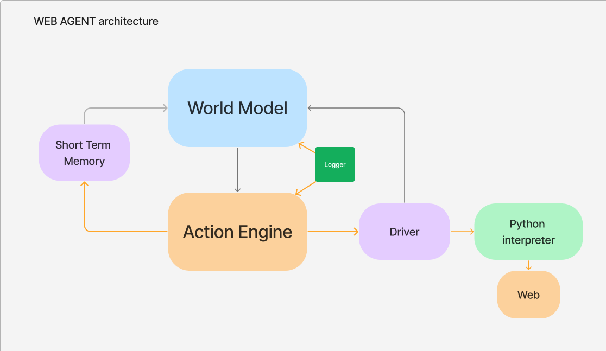

# Web Agents

Web Agents wrap around and combine all our key components to allow user to easily automate the actions needed to achieve an objective. Web agents are made up of:

- A [World Model](./world-model.md): Responsible for providing the next natural language instruction needed to eventually reach our objective
- An [Action Engine](./action-engine.md) (and its [driver](./browser-drivers.md)): Responsible for turning instructions into actions and executing them
- Short Term Memory: Provides information about past actions to be considered by the World Model
- A [logger](./local-log.md): Logs information about the last agent run



## Web agent arguments

The Web Agent class accepts the following arguments:

| Parameter                | Description                                                                                                                                                                                                                                  | Default Value |
|--------------------------|----------------------------------------------------------------------------------------------------------------------------------------------------------------------------------------------------------------------------------------------|---------------|
| `world_model`            | Required World Model instance                                                                                                                                                                                                               | N/A           |
| `action_engine`          | Required Action Engine instance                                                                                                                                                                                                             | N/A           |
| `n_steps`                | An integer value for the maximum number of steps or instructions you allow your agent to take before reaching a conclusion. Reducing this value can act as a protection against a very costly multi-step query - however, if you set this value too low, your agent may not have enough steps in which to successfully complete the task. | 10            |
| `clean_screenshot_folder`| Boolean value to set whether LaVague should clear all previous files in the "./screenshots" folder before adding new screenshots to this folder.                                                                                              | True          |

## Web Agents key methods

The Web Agent has two key methods.

### Get

```python
agent.get("https://huggingface.co/docs")
```

This method takes a string `url` and navigates to this page with the Action Engine's web driver.

If your driver uses `non-headless mode` (set by initializing the driver with the headless=False option), at this point a browser will open and navigate to this page.

If you are in headless mode, the web driver will still navigate to the URL but you won't be able to see this happen in your graphical interface.

### Run

The `Run` method will use the Agent's World Model and Action Engine to generate and perform the steps needed to complete the `objective`. 

```python
ret = agent.run("Go on the quicktour of PEFT", display=True)
```
It returns a `ActionResultobject` containing: 

- instruction: the user objective
- code: all the code of the successful actions run (for Navigation Engine only)
- success: boolean of if the objective was achieved
- output: the output if any (for example information retrieved from a website)

If you are using `non-headless` mode, you will be able to see these actions performed in real-time in your browser window. You can alternatively use the `display` to visualize updated screenshots as the actions are performed if you are using `headless` mode. If not, you will not be able to visualize the navigation taking place in your graphical interface, but will still receive the output of the agent's series of actions.

#### Method arguments:

| Parameter   | Description                                                                                                                                                                                                           | Default |
|-------------|-----------------------------------------------------------------------------------------------------------------------------------------------------------------------------------------------------------------------|---------|
| objective   | Required argument, a string objective that the web agent should achieve.                                                                                                                                              | N/A     |
| user_data   | User data of any type, but typically structured data such as a JSON or dictionary, to be taken into account by the World Model. For example, you might send an object containing the personal details needed for the Agent to fill in a form. This data is added to the Short Term Memory's current_state with the [`internal_state`][`user_inputs`]. | None    |
| display     | If set to True, the agent will display updated screenshots in real-time as the driver performs actions. This option can be useful for visualizing web driver actions in a browserless environment where you are using headless mode, such as in a Google Colab. | False   |

### `Demo`

The demo method works similarly to the `run` method, but will launch an interactive demo mode, which we can access by clicking on the public or local URL generated by the method in your terminal. From there you can input different URLs and objectives and see the steps, actions and outputs in real-time in the built-in browser display and chat box.

```python
agent.demo("Go on the quicktour of PEFT")
```

#### Method arguments:


| Parameter         | Description                                                                                                                                                                                                                                                                                                                                                   | Default |
|-------------------|---------------------------------------------------------------------------------------------------------------------------------------------------------------------------------------------------------------------------------------------------------------------------------------------------------------------------------------------------------------|---------|
| objective         | Required argument, a string objective that the web agent should achieve.                                                                                                                                                                                                                                                                                      | N/A     |
| user_data         | User data of any type, but typically structured data such as a JSON or dictionary, to be taken into account by the World Model. For example, you might send an object containing the personal details needed for the Agent to fill in a form. This data is added to the Short Term Memory's current_state with the [`internal_state`][`user_inputs`].             | None    |
| screenshot_ratio  | A float value, by default 1, to adjust the size ratio of the screenshot shown (reducing the size of the screenshots in the visual display could be of interest where screenshots take too long to load). The image width and height is divided by the value you specify. For example, if set to 2, the height and width of the screenshots will be halved in size. | 1       |

!!! note "Gradio Agent Demo no_load_strategy"
    For faster performance when using the `agent.demo()` method, you should set the `no_load_strategy` Driver option to True.

    This turns off Selenium's default load strategy that waits for the page to be fully loaded before giving you back control which was causing a significant slowdown with our `Gradio Agent Demo`. Instead, LaVague will detect when the page is loaded.

    This option is not recommended with the `agent.run()` method however.