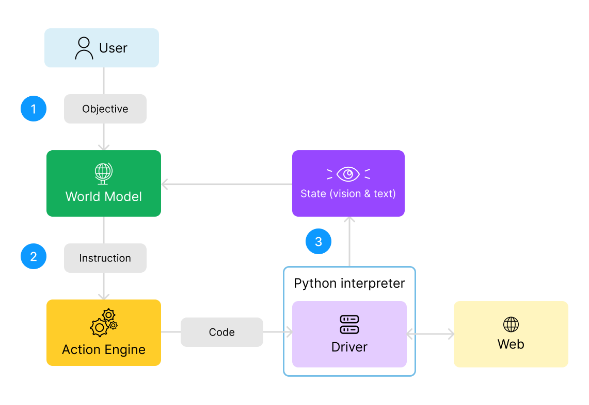

# LaVague Architecture & Workflow

## Definitions

Let's first define some of the key elements in our LaVague Agent architecture:

- `Objective`: The objective is the global goal that the user wants the Web Agent to achieve. For example: `"Log into my account and change my username to The WaveHunter."`
- `Instruction:` An instruction is the a smaller step needed to move towards achieving the user's objective. For example: `"Locate the username input field and enter the text 'user123'."`
- `World Model`: The World Model analyzes the user's objective and the current state of a webpage to generate the next instruction needed in order to eventually achieving the objective.
- `Action Engine`: The Action Engine receives this instruction and generates the automation code required to perform this action.
- `Driver`: The webdriver is both leveraged for the execution of the action code generated by the Action Engine and provides the World Model with **perception** through screenshots and HTML source code of current state of the webpage.

## Workflow

All the elements previously described interact in the following workflow:



1. The user's global objective is handled by the World Model. It considers this objective along with the state of the webpage through screenshots and HTML code, and generate the next step, aka. text instruction, needed to achieve this objective.

2. This instruction is sent to the ActionEngine, which then generates the automation code needed to perform this step and executes it.

3. The World Model then receives new text and image data, aka. a new screenshot and the updated source code, to reflect the updated state of the web page. With this information, it is able to generate the next instruction needed to achieve the objective.

4. This process repeats until the objective is achieved!


## Example workflow

To make this workflow clear, let's consider an example:

1. The World Model is given the following objective: `"Log into my account and change my username to The WaveHunter."`

    The driver provides the World Model with the initial state of the webpage: the login page is loaded with empty username and password fields.   
    
    The World Model might then generate the following first instruction: `"Locate the username input field and enter the text 'user123'."`

2. The Action Engine receives the instruction, and generates the following automation code, which is then executed:

    ```python

    from selenium.webdriver.common.by import By
    from selenium.webdriver.common.keys import Keys
    driver.find_element(By.ID, 'username').send_keys('user123')
    ```

3. The webpage state is updated (username is now entered in the field). A new screenshot and HTML source are captured.

    The World Model receives the updated state and generates the next instruction:`"Locate the password input field and enter the text 'password456'."`

This process repeats until the final objective is achieved.

## Current research

Several elements of our approach and architecture are inspired by Yann LeCun's research paper: [A Path Towards Autonomous Machine Intelligence](https://openreview.net/pdf?id=BZ5a1r-kVsf).

The paper proposes an architecture for AI that consists of multiple modules, each responsible for different functions such as perception, world modeling, memory, and action generation. These modules work together to enable the AI to perceive its environment, react to it, reason about it, plan actions, and execute them, much like the human brain leverages and combines different cognitive processes.

