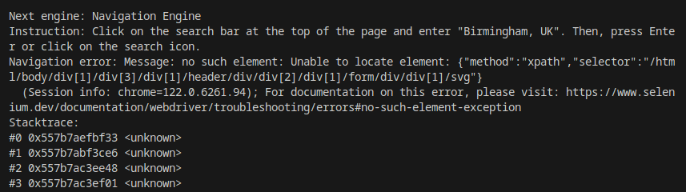
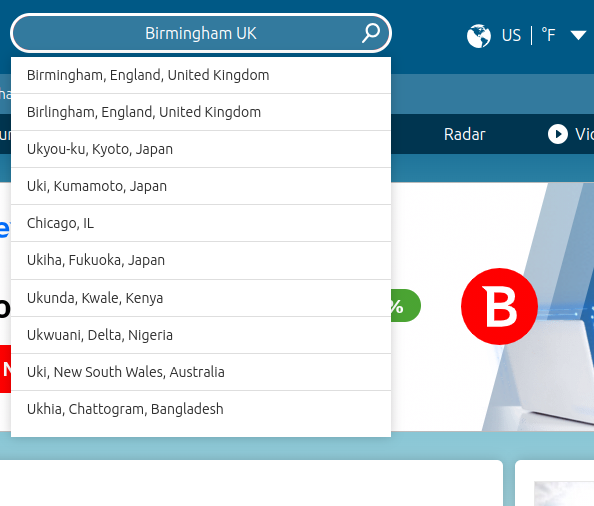
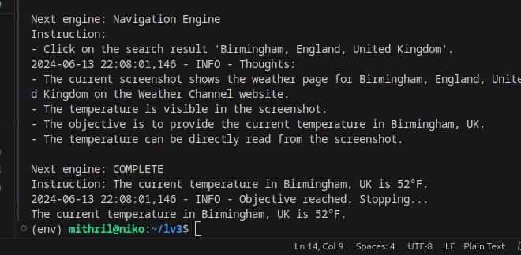

# End-to-end debugging

When using LaVague, you may find that our Web Agents are not always able to successfully achieve the objective you set them out of the box, leading to either incorrect results or `Navigation errors`.

Our Agents are designed to be as customizable as possible so you can adjust components to get the best result for your particular use case.

!!! hint "Common issues"

    Problems with performance usually stem from one of three components: 

    - The World Model
    - The Retriever
    - The Action Engine

In this guide, we'll take a look at how you can debug and make adjustments to rectify issues with each of these components.

## Debugging the World Model

!!! abstract "Case one"
    The World Model's is either providing the Action Engine with poor instructions.

### How to detect World Model performance issues?

Bad instructions from the World Model should be simple to spot and debug since the World Model outputs its "thoughts" and next instruction in real-time. 

We can therefore visually verify the outputted instructions seem appropriate for achieving our objective.

### How to improve World Model performance?

#### Adding knowledge to World Model prompt

In the following example, we want to get the current temperature in Birmingham UK from the website `weather.com`:

```python
selenium_driver = SeleniumDriver(headless=False)
world_model = WorldModel()
action_engine = ActionEngine(driver=selenium_driver)
agent = WebAgent(world_model, action_engine)

url = "https://weather.com/"
objective = "What is the temperature now in Birmingham UK?"
agent.get(url)
ret = agent.run(objective)
print(ret.output)
```

When we run this Code, the World model repeatedly instructs the Action Engine click on the search button after inputting `Birmingham` into the website's search bar, which repeatedly fails with `navigation errors` like the following:



As a human user testing out the site, we quickly understand that the search button is not working and instead we can wait for a drop-down menu of search results to load and click on the appropriate result.

We can teach our World Model to behave differently and produce different instructions by providing it with extra knowledge.

For this example, we can provide the World Model with the following knowledge saved in a `knowledge.txt file`:

!!! note "Knowledge.txt file"
    We should not press the search button. Instead we should just type a search entry into the search bar and then wait for 3 seconds must be sure to wait for 3 seconds.

    Example:

    Thoughts:

    - The screenshot shows the homepage of the website 'weather.com'.
    - The objective is to return the current temperature in the location you wish to search for
    - The best next step is to use the Navigation Engine to search for the location on the website.
    Next engine: Navigation Engine
    
    Instruction:

    - Click on the search bar.
    - Type the location in the search bar.
    - Enforce a pause of 3 seconds

We send this extra knowledge to the World Model by providing the path to our `knowledge.txt` file to the `WorldModel.add_knowledge()` method:

```python
world_model = WorldModel()
world_model.add_knowledge(file_path="knowledge.txt")
```

If I retry running the agent with this updated World Model with my original objective, the World Model now gives the following first set of instructions:

```bash
Next engine: Navigation Engine
    
Instruction:
    
- Click on the search bar.
- Type "Birmingham UK" in the search bar.
- Enforce a pause of 3 seconds
```
By teaching the World Model to pause instead of clicking on the search button, the drop-down menu has time to load and will be taken into consideration in the screenshot taken by the World Model when creating its next set of instructions.



The World Model will then click on the link to the Birmingham weather page and correctly returns the current temperature in Birmingham, UK.




✅ By adding a small amount of text knowledge, we were able to teach our World Model how to perform search correctly on this website.

## Debugging the Retriever

!!! abstract "Case two"
    The World Model has sent the Action Engine a correct instruction, but the Retriever does not retrieve the relevant HTML elements required for the LLM to generate code targetting the correct HTML elements (XPATH).

> Note the retriever is only used when the next instruction is sent to the `Navigation Engine`.

### How to detect Retriever performance issues?

The Retriever is leveraged by the `Action Engine` to get the top X (5 by default) HTML elements that it identifies as most relevant to completing the current instruction. 

We can easily detect if performance issues are stemming from the Retriever by displaying these retrieved HTML elements, or nodes, and visually verifying that the nodes retrieved include the relevant HTML element needed to complete the instruction.

For example, if the instruction is to 'Type John into the first name field of the form', we could expect the retrieved nodes to include the HTML element for the `first name` field of the form.

To view the nodes for each step (instruction sent to the Action Engine by the World Model). You can use the `display_previous_nodes` method:

```python
step = 0 # View nodes retrieved for first instruction
agent.display_previous_nodes(step)
```

This will provide both a visual representation and the HTML code for each element retrieved.


### How to improve Retriever performance?

There are a few ways in which we can modify the Retriever to tackle performance issues.

#### Adjusting rank_fields

The `rank_fields` option defines the attributes of HTML elements that will be considered for ranking relevance when retrieving the most relevant elements. By default we take into account the`element`, `placeholder`, `text` and `name` attributes.

To take an example, we can imagine our Action Engine receives the instruction `Type Sarah into the first name form field` but fails to retrieve the relevant `first name` text input field.

We can inspect the HTML of this element by right-clicking and selecting `inspect` on this webpage in our browser.

```html
<input type="text" id="fname" value="John">
```

If the HTML code is as seen above, we might decide to add the `type` and `id` fields to our `rank_fields` argument.

```python
from lavague.core import WorldModel, ActionEngine
from lavague.core.agents import WebAgent
from lavague.drivers.selenium import SeleniumDriver
from lavague.core.retrievers import OpsmSplitRetriever

driver=SeleniumDriver()
retriever = OpsmSplitRetriever(rank_fields=["element", "placeholder", "text", "name", "type", "id"], driver=driver)
action_engine = ActionEngine(driver=driver, retriever=retriever)
agent = WebAgent(WorldModel(), action_engine)
```

#### Adjusting top_k

By default, the retriever will pass on the 5 most relevant nodes it finds to the LLM, which uses this information to generate code targetting the XPATH of the correct element.

We can try to increase the likelihood of the retriever finding the correct node by to increasing the X most relevant number of nodes the Retriever will return:

```python
from lavague.core import WorldModel, ActionEngine
from lavague.core.agents import WebAgent
from lavague.drivers.selenium import SeleniumDriver
from lavague.core.retrievers import OpsmSplitRetriever

driver=SeleniumDriver()
retriever = OpsmSplitRetriever(top_k=10, driver=driver)
action_engine = ActionEngine(driver=driver, retriever=retriever)
agent = WebAgent(WorldModel(), action_engine)
```

#### Changing the Retriever

We can also test out performance with different retrievers for your task.

In the following example, we select the retriever to the built-in `CohereRetriever` from the optional package `lavague-retrievers-cohere`.

```python
from lavague.core import WorldModel, ActionEngine
from lavague.core.agents import WebAgent
from lavague.drivers.selenium import SeleniumDriver
from lavague.retrievers.cohere import CohereRetriever

retriever = CohereRetriever()
action_engine = ActionEngine(driver=SeleniumDriver(), retriever=retriever)
agent = WebAgent(WorldModel(), action_engine)
```

## Debugging the Action Engine

!!! abstract "Case three"
    The Navigation or Python Engine has received a correct instruction and (in the case of the Navigation Engine) has the correct nodes, but it is still generating incorrect code.

### Adding knowledge or examples to LLM prompt (🚧⏳ Coming soon)

We are currently changing our framework to make it easier to modify the Selenium or Playwright prompt leveraged by the Navigation Engine to produce code. Instructions will be added here after this update.

See our [GitHub issue](https://github.com/lavague-ai/LaVague/issues/361) to follow out progress.

### Changing the LLM

We can also change the LLM we use to complete our task.

In the following example, we set our Action Engine to use Gemini's `1.5-flash-latest` LLM:

```python
from llama_index.llms.gemini import Gemini
from lavague.core import WorldModel, ActionEngine
from lavague.core.agents import WebAgent
# Customizing the LLM, multi-modal LLM and embedding models
llm = Gemini(model_name="models/gemini-1.5-flash-latest")

action_engine = ActionEngine(driver=driver, llm=llm, embedding=embedding)
agent = WebAgent(WorldModel(), action_engine)

```

!!! note "Evaluating LLMs & Retrievers"

    See our [Evaluator module guide](https://docs.lavague.ai/en/latest/docs/learn/evaluation/) for details on how to benchmark LLM and Retriever performance.