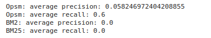
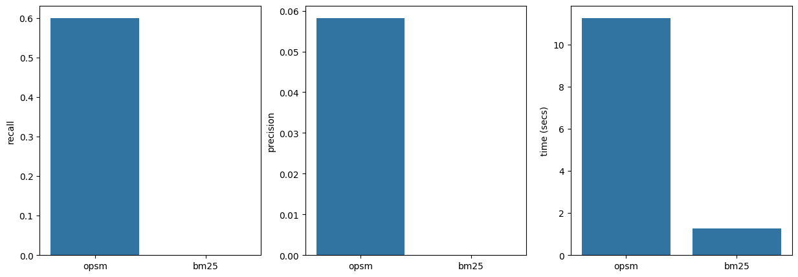
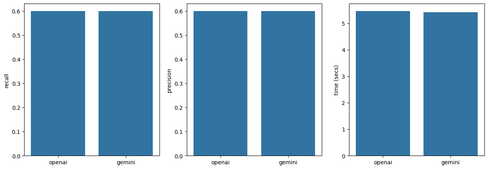

# Evaluator

The evaluator module allows us to assess the performance of the retriever and LLM used by the Navigation Engine in order to generate an action based on a natural language instruction.

The evaluator allows users to assess the performance of different open and closed-source LLMs and retrievers with different parameters.

!!! note "What we evaluate?"

    #### Retriever
    
    - `recall_retriever:` The retriever recall measures the retriever's ability to find all the necessary HTML element(s) from the dataset for the task. It is about ensuring that no relevant item is missed.
    - `precision_retriever:` The retriever precision measures the retriever's accuracy in retrieving the necessary HTML element(s). It measures how many of the retrieved items are actually relevant to the task.
    - `retrieval_time:` Time taken to retrieve nodes.
    
    #### LLM

    - `LLM recall:` LLM recall measures the LLM's ability to identify the correct XPATH of the element needed to perform the action.
    - `LLM precision:` The LLM precision measures the accuracy of the LLM in targeting the correct HTML element.
    - `code_generation_time:` Time taken to generate action.

<a target="_blank" href="https://colab.research.google.com/github/lavague-ai/LaVague/blob/eval-docs/docs/docs/get-started/notebooks/eval.ipynb">
</a>

## Getting started with the evaluator

### Evaluating retrievers

#### Getting set-up

First of all, we'll need to import and initialize a RetrieverEvaluator object.

```python
from lavague.core.evaluator import RetrieverEvaluator

retriever_evaluator = RetrieverEvaluator()
```

Next, we will download the dataset we will use for this example, `TheWaveMetaSmall.csv`. This is a reduce 5-row version of our larger 250-row [dataset](https://huggingface.co/datasets/BigAction/the-wave-250) which we curated for evaluation. It contains a natural language query (or instruction) alongside the correct node to be retrieved and XPATH for the LLM to target in order to successfully achieve the instruction.

```bash
wget https://raw.githubusercontent.com/lavague-ai/LaVague/main/examples/TheWaveMetaSmall.csv
```

We need to transform this CSV file into a Panda's dataset and pass it through a necessary pre-processing function `rephrase_dataset` in order to be able to use it with our evaluator module. 

The `rephrase_dataset` function splits the original query into two rephrased queries, aimed either specifically at the retriever or the LLM, and adds them as the following columns in the dataset: `retriever_query` & `llm_query`.

```python
import pandas as pd
import os

raw_dataset = pd.read_csv("TheWaveMetaSmall.csv")
rephrased = retriever_evaluator.rephrase_dataset(raw_dataset, "TheWaveSmallRephrased.csv")
```

#### Running the evaluator

Now that we have a correctly formatted `rephrased` Pandas DataFrame, we can run the `evaluate` method on the retrievers of our choice. 

In this case we compare our default `OpsmSplitRetriever` against our legacy `BM25HTMLRetriever`.

We pass the `evaluate` method the retriever we wish to evaluate, along with the `rephrased` Panda's DataFrame and the file name we wish to give to the CSV file which will be output by the method.

This method will return a new DataFrame which is made up of the original `rephrased` dataset, plus the following columns:

Column	Description
recall_retriever	Retriever's recall.
precision_retriever	Retriever's precision.
retrieval_time	Time taken for retrieval.
source_nodes	Source nodes retrieved.
html_id	HTML page with unique IDs added to tags required for the retrieval pipeline.
!!! important "Embedding model"
    The retrievers will use our default `OpenAI's text-embedding-3-large` embedding model. You will therefore need to have an OPENAI_API_KEY set in your current environment.
    
    If you wish to change the embedding model, you can pass any LlamaIndex-compatible embedding model to our Retriever's `embedding` parameter.

```python
from lavague.core.retrievers import OpsmSplitRetriever, BM25HtmlRetriever
from lavague.drivers.selenium import SeleniumDriver

driver = SeleniumDriver()

retrieved_data_opsm = retriever_evaluator.evaluate(
    OpsmSplitRetriever(driver), rephrased, "retrieved_data_opsm.csv"
)
retrieved_data_bm25 = retriever_evaluator.evaluate(
    BM25HtmlRetriever(driver), rephrased, "retrieved_data_bm25.csv"
)
```

??? note "Retriever optional parameters"

    It can be interesting to use the evaluator to assess the performance impact of different optional parameters to the retriever.

    Retrievers have the following optional arguments:

    | Parameter     | Description                                                                                                                                                          | Default                           |
    |---------------|----------------------------------------------------------------------------------------------------------------------------------------------------------------------|-----------------------------------|
    | `driver`      | The web driver to be used by the Retriever to get source code. This is a mandatory argument.                                                                         | N/A                               |
    | `embedding`   | The embedding model to be used.                                                                                                                                      | OpenAI's `text-embedding-3-large` |
    | `top_k`       | The top X number of nodes to be retrieved.                                                                                                                           | 5                                 |
    | `group_by`    | Defines the size of chunks when grouping the HTML elements' attributes into manageable sets for processing.                                                          | 10                                |
    | `rank_fields` | Specifies the fields (attributes) of HTML elements that will be considered for ranking relevance when retrieving the most relevant elements based on a query.         | `["element", "placeholder", "text", "name"]` |

#### Viewing results

First of all, let's see how we can print out the average precision and recall values of our retrievers by accessing the `precision_retriever` and `recall_retriever` columns of our resulting datasets.

```python
print(f' Opsm: average precision: {retrieved_data_opsm["precision_retriever"].mean(axis=0)}')
print(f' Opsm: average recall: {retrieved_data_opsm["recall_retriever"].mean(axis=0)}')
print(f' BM2: average precision: {retrieved_data_bm25["precision_retriever"].mean(axis=0)}')
print(f' BM25: average recall: {retrieved_data_bm25["recall_retriever"].mean(axis=0)}')
```




Next, we can then use the `compare` method to visualize the precision, recall and time taken for each retriever.

You can use this method with as many results DataFrames as you like by passing them as a dictionary with the label of your choice for each `key` and the relevant results DataFrame as the `value`.

The `compare` method returns a `matplotlib.pyplot`. 

You can create many different visualizations using this object. See the [official documentation](https://matplotlib.org/3.5.3/api/_as_gen/matplotlib.pyplot.html) for more details.

```python
# with as many df as you want
plot = retriever_evaluator.compare(
    {"opsm": retrieved_data_opsm, "bm25": retrieved_data_bm25}
)

# pass arguments with matplotlib
plot.show()
```



We can see from these results that our default `OpsmSplitRetriever outperforms the legacy BM25 retriever on recall and precision.

> Remember, there are only 5 rows in our dataset. We can expect to see a recall and retrieval value above 0 for the `BM25 retriever` with a bigger dataset!

### Evaluating LLMs

Let's now take a look at how we can evaluate the performance of an LLM to be used by the [Navigation Engine](../learn/navigation-engine.md) in our AI pipeline.

For this example, we will compare the performance of OpenAI's gpt-4o against Gemini's `gemini-1.5-flash-latest`.

In order to run this example, you will need both an `OPENAI_API_KEY` and `GOOGLE_API_KEY` set in your working environment.

> Please bear in mind that running the evaluator on large datasets with paying LLMs could be costly.

#### Getting set-up

First of all, we'll need to create an instance of `LLMEvaluator` and create two Navigation Engines: one using our default `OpenaiContext` and one using our default `GeminiContext`. These contexts will set the LLMs of each engine to the models mentioned above.

```python
from lavague.core.evaluator import LLMEvaluator
from lavague.contexts.openai import OpenaiContext
from lavague.contexts.gemini import GeminiContext
from lavague.core.navigation import NavigationEngine
import os
from lavague.drivers.selenium import SeleniumDriver

llm_evaluator = LLMEvaluator()
openai_engine = NavigationEngine.from_context(OpenaiContext(), SeleniumDriver())
gemini_engine = NavigationEngine.from_context(GeminiContext(), SeleniumDriver())
```

#### Running the evaluator

Now we can evaluate the LLMs by calling the `LLMEvaluator.evaluate` method with the following arguments:

- The Navigation Engine we wish to evaluate
- The DataFrame previously generated by the RetrieverEvaluator.evaluate method. This is required to be able to run the LLMEvaluator.
- The file path where we wish the results of the evaluation to be stored as a CSV file.

```python
openai_results = llm_evaluator.evaluate(openai_engine, retrieved_data_opsm, "openai_results.csv")
gemini_results = llm_evaluator.evaluate(gemini_engine, retrieved_data_opsm, "gemini_results.csv")
```

The method returns a DataFrame made up of the `retrieved_data_opsm` dataframe, with the following appended columns:

### Revised Definitions:

| Column              | Definition                                                                                       |
|------------------------|--------------------------------------------------------------------------------------------------|
| `recall_llm`           | The recall measurement for the LLM.                                                              |
| `precision_llm`        | The precision measurement for the LLM.                                                           |
| `execution_error`      | The error encountered during the execution of the generated code, if any.                        |
| `target_outer_html`    | The HTML content of the target element identified by the generated code.                         |
| `generated_code`       | The code generated by the navigation engine in response to the query.                            |
| `retry`                | The number of attempts taken to successfully execute the generated code.                         |
| `code_generation_time` | The time taken by the navigation engine to generate the code.                                    |

### Visualizing results

Similarly to the RetrieverEvaluator, we can either access results directly or use the `compare` method to generate a `matplotlib.pyplot` object comparing the recall, precision and time taken by the two LLMs.

```python
plot = llm_evaluator.compare(
    {
        "openai": openai_results,
        "gemini": gemini_results,
    }
)
plot.show()
```



In this case, we see identical performance from the two LLMs, but we would see more variation when testing with a bigger dataset.

!!! science "Next steps"

    Please feel free to evaluate LaVague with different open or closed-source LLMs, options or retrievers. You can share your findings with us on [Discord](https://discord.gg/8PcrX3u8)!