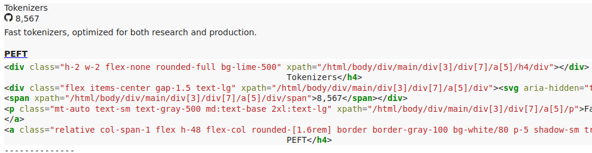
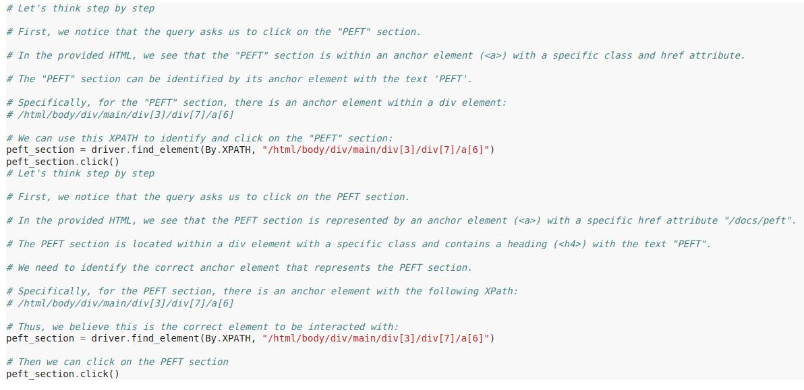
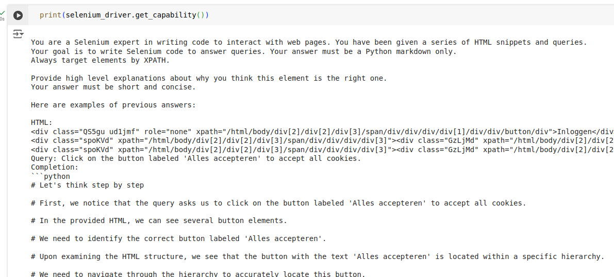

# Navigation Engine

The Navigation Engine is the engine dedicated to generating and executing Selenium code to perform an action on a web page.

Let's get to know the Navigation Engine better by removing the usual layers of abstraction and working directly with one as an agent would!

<a target="_blank" href="https://colab.research.google.com/github/lavague-ai/lavague/blob/main/docs/docs/learn/notebooks/NavigationEngine.ipynb">
</a>

### Initializing a Navigation Engine

First of all, we'll need to create an instance of Navigation Engine.

```python
from lavague.drivers.selenium import SeleniumDriver
from lavague.core.navigation import NavigationEngine


selenium_driver = SeleniumDriver(headless=True, url="https://huggingface.co/")
nav_engine = NavigationEngine(selenium_driver)
```

### Retrieval

The first task handled by the Navigation Engine is to perform retrieval on the web page to collect the most relevant chunks, or nodes, of HTML code.

The Navigation Engine's embedding model is used at this stage (here we use the default embedding model, OpenAI's `text-embedding-3-large`).

```python
instruction = "Click on the PEFT section."

nodes = nav_engine.get_nodes(instruction)
```

We can print out these nodes with the following code:

```python
from IPython.display import display, HTML, Code

for node in nodes:
    display(HTML(node)) # Display node as visual element
    display(Code(node, language="html")) # Display code
    print("--------------")
```


### Generating automation code

We can now provide these nodes as context for our LLM (here, we use the default LLM, `gpt-4o`) when we generate the appropriate code for our instruction.

```python
context = "\n".join(nodes)

action = nav_engine.get_action_from_context(context, instruction)

display(Code(action, language="python"))
```



### Navigation Engine LLM prompt

The LLM was queried with our default Navigation Engine prompt template which you can view in full [here](https://github.com/lavague-ai/LaVague/blob/9764805bd756d15c83943baa968d35f979242314/lavague-core/lavague/core/navigation.py#L28).


We see that the prompt is made up of three parts:
- The `driver capability` or driver prompt template
- The `context string`, or retrieved nodes
- The `query` itself - this will be the original instruction received by the Navigation Engine after passing through the `rephrase_query` method which standardizes and optimizes instructions for the best AI Performance

We can see the default Selenium driver prompt template with the following code (or view the full code [here](https://github.com/lavague-ai/LaVague/blob/9764805bd756d15c83943baa968d35f979242314/lavague-integrations/drivers/lavague-drivers-selenium/lavague/drivers/selenium/base.py#L177)):

```python
from lavague.drivers.selenium import SELENEIUM_PROMPT_TEMPLATE

print(SELENIUM_PROMPT_TEMPLATE)
```


