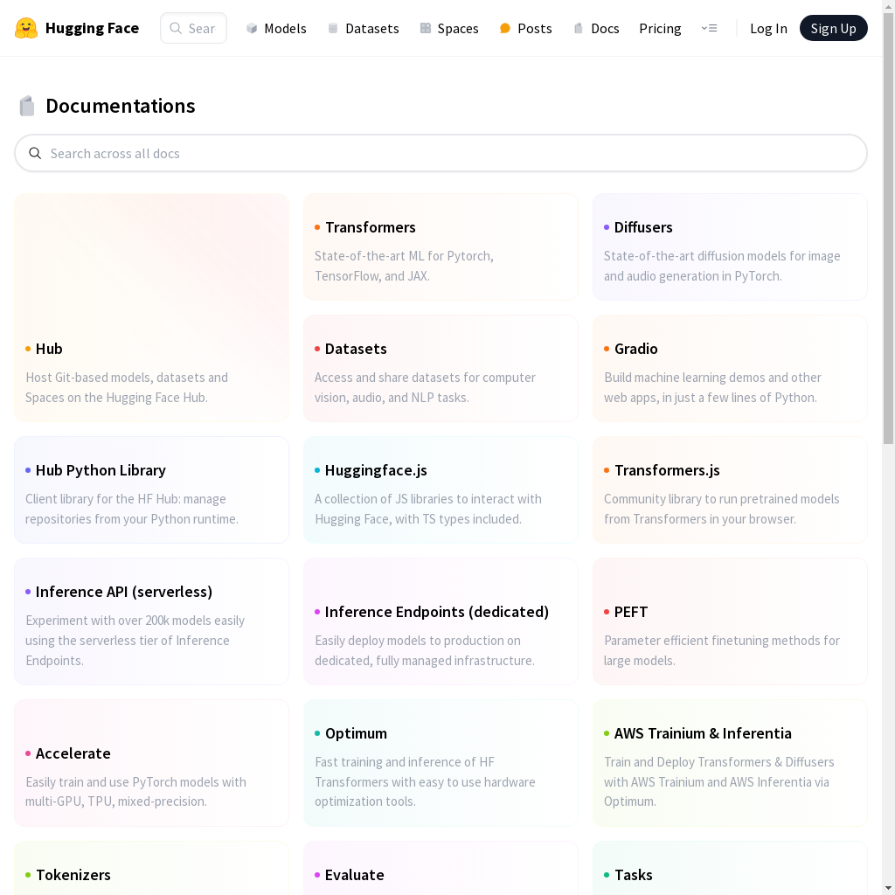
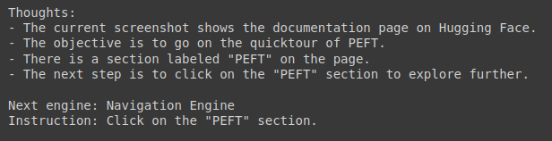
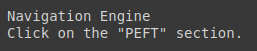
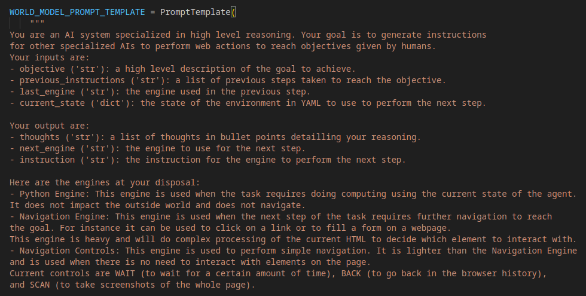
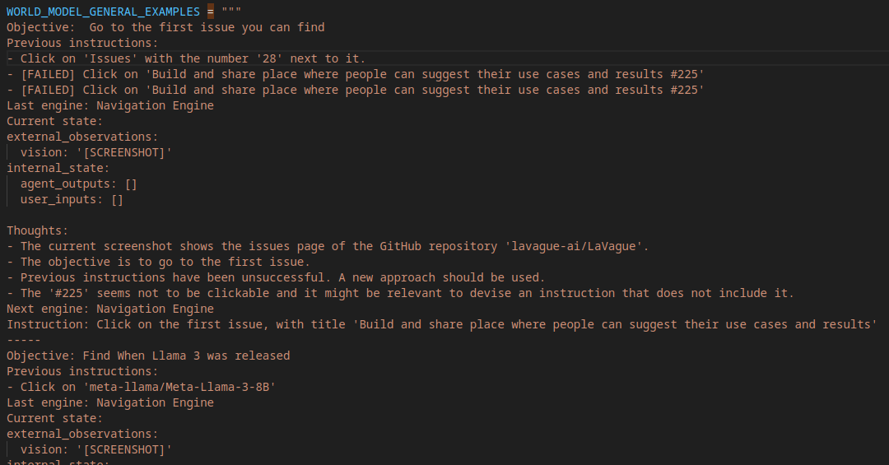

# World Model

### What is the World Model?

The World Model takes a user objective and the current state of a webpage and uses this information to generate:

- the next instruction required to eventually achieve the user objective
- the name of the Action Engine sub-engine component which should be used to execute the instruction

In our agentic workflow, the Agent will get the next instruction and engine to be used by calling the `WorldModel.get_instruction` method before passing these two strings to the Action Engine, which will handle executing the instruction.

### Getting started with the World Model 

<a target="_blank" href="https://colab.research.google.com/github/lavague-ai/lavague/blob/main/docs/docs/learn/notebooks/WorldModel.ipynb">
</a>

Let's now create an instance of World Model that we can work with directly to understand better how it works.

```python
from lavague.core import  WorldModel

world_model = WorldModel()
```

The World Model receives multiple inputs to make informed decisions:
- `objective`: The user's objective
- `current_state`: Internal and external state that includes some internal memory from agent outputs and user inputs
- `past`: previous generated instructions
- `obs`: The current HTML, screenshot, URL of the webpage + the current date/time

Before we can start using our World Model, we first need to generate these observations.

```python
from lavague.drivers.selenium import SeleniumDriver
from lavague.core.memory import ShortTermMemory

selenium_driver = SeleniumDriver(headless=True, url="https://huggingface.co/")
st_memory = ShortTermMemory()

# Generate observations & set objective
objective = "Go on the quicktour of PEFT"
current_state, past = st_memory.get_state()
obs = selenium_driver.get_obs()
```

To understand what inputs the World Model receives, we can visualize the screenshots captured during the observation process.

```python
# Visualize the screenshot
from lavague.core.logger import load_images_from_folder
from IPython.display import display 

images = load_images_from_folder(obs["screenshots_path"])
display(images[0])
```


The World Model receives multiple inputs to make informed decisions:

- Objective
- Internal and external state that comprises the current HTML, screenshot, some internal memory in agent_outputs and user provided data with user_inputs
- Past with previous instructions

```python
print("Objective: ", objective)
print("Current State: ", current_state)
print("Past: ", past)
print("Observations: ", obs)
```


We can now pass this information to the World Model to get the next instruction to be completed. 

```python
world_model_output = world_model.get_instruction(
    objective, current_state, past, obs
)

print(world_model_output)
```



The generated instruction provides insights into the World Model's thought process, including the recommended engine and instruction for the agent.

```python
from lavague.core.utilities.format_utils import (
    extract_next_engine,
    extract_world_model_instruction,
)

next_engine_name = extract_next_engine(world_model_output)
instruction = extract_world_model_instruction(world_model_output)

print(next_engine_name)
print(instruction)
```



### How does it work?

The World Model generates the next instruction by querying the multi-modal LLM (by default, we use OpenAI's gpt-4o) with our `prompt template`. 

You can print out our default World Model template with the following code or view the full template [here](https://github.com/lavague-ai/LaVague/blob/d046e6ccba87bc629b8608046b5001020fa5382e/lavague-core/lavague/core/world_model.py#L213):

```python
from lavague.core.world_model import WORLD_MODEL_PROMPT_TEMPLATE

print(WORLD_MODEL_PROMPT_TEMPLATE.template)
```



This shows us the overall guidelines. Let's now see now how [examples](https://github.com/lavague-ai/LaVague/blob/d046e6ccba87bc629b8608046b5001020fa5382e/lavague-core/lavague/core/world_model.py#L11) are provided to provide world knowledge:

```python
from lavague.core.world_model import WORLD_MODEL_GENERAL_EXAMPLES

print(WORLD_MODEL_GENERAL_EXAMPLES)
```



If we wanted to add knowledge to our World Model prompt template, we can do so with the `add_knowledge` method:

```python
extra_knowledge = """
Objective: Find the latest papers on Fine tuning
Previous instructions:
- SCAN
- Click on 'Previous'
Last engine: [NONE]
Current state:
external_observations:
  vision: '[SCREENSHOT]'
internal_state:
    agent_outputs: []
    user_inputs: []

Thoughts:
- The current screenshot shows the top of a page showing papers papers published on the 22nd May 2024 on Hugging Face.
- The objective is to find the latest papers on Fine tuning.
- As we need to find the latest papers, the best next step is to gather more information to see if this page contains the information we need.
- The best next step is to use the Navigation Controls to take a screenshot of the whole page to find the latest papers on Fine tuning.
Next engine: Navigation Controls
Instruction: SCAN
"""

world_model.add_knowledge(extra_knowledge)
```

!!! tip "Improving performance"
    By adding knowledge, we can improve the World Model's performance where it is failing to generate correct next instructions.

If you want to replace the default examples passed to the World Model entirely, you can do so by initializing your `WorldModel` and passing your examples as a string as an `examples` optional argument:

```python
new_examples = "[YOUR_EXAMPLES_HERE]"
world_model = WorldModel(examples=new_examples)
```

### Customizing your World Model

### World Model from Context

You can customize the `mm_llm` multi-modal LLM used by the World Model by instantiating it from a `Context` object with the `WorldModel.from_context` method.

Details on how to do this are provided in our [customization guide](../get-started/customization.md).

### Optional arguments

Alternatively, you can pass your World Model class any of the four key customizable arguments:

- `mm_llm`: A Multi-modal LLM. This can be any `llama_index.multi_modal_llms` object. By default, we use OpenAI's gpt-4o.
- `prompt_template`: The prompt template used to query the multi-model LLM to generate the next instruction
- `examples`: A string containing examples of how we expect the WorldModel to reason and produce a good next instruction
- `logger`: An AgentLogger which records information about the World Model

Once initialized, the World Model can be used as seen previously.