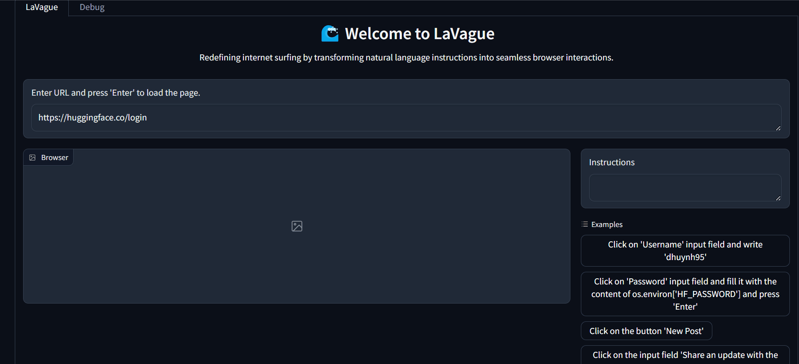

## 🏄‍♀️  What is LaVague?

LaVague is an **open-source** project designed to automate automation for devs! We use **advanced AI techniques** to turn **natural language queries** into Python code leveraging Selenium. LaVague is designed to make it easy for users to automate express web workflows and execute them on a browser.

### LaVague in Action

Here's an examples to show how LaVague can execute natural lanaguge instructions on a browser to automate interactions with a website:



## 🚀 Getting Started

### Running LaVague in your local env

You can get started with `LaVague` in 2 steps:

1. Install LaVague & dependencies
```
wget https://raw.githubusercontent.com/lavague-ai/LaVague/main/setup.sh &&
sudo bash setup.sh
```

2. Run your LaVague command!
```
lavague --instructions examples/instructions/huggingface.yaml --config examples/configurations/api/openai_api.py build
```

For a step-by-step guide or to run LaVague in a Google Colab, see our [quick-tour](https://docs.lavague.ai/en/latest/docs/get-started/quick-tour/) which will walk you through how to get set-up and launch LaVague with our CLI tool.

## 🎭 Playwright integration

If you want to get started with LaVague build using Playwright as your underlying automation tool, see our [Playwright integration guide](./docs/get-started/playwright.md)

## 🙋 Contributing

We would love your help in making La Vague a reality. 

To avoid having multiple people working on the same things & being unable to merge your work, we have outlined the following contribution process:

1) 📢 We outline tasks on our [`backlog`](https://github.com/orgs/lavague-ai/projects/1/views/3): we recommend you check out issues with the [`help-wanted`](https://github.com/lavague-ai/LaVague/labels/help%20wanted) labels & [`good first issue`](https://github.com/lavague-ai/LaVague/labels/good%20first%20issue) labels

2) 🙋‍♀️ If you are interested in working on one of these tasks, comment on the issue!

3) 🤝 We will discuss with you and assign you the task with a [`community assigned`](https://github.com/lavague-ai/LaVague/labels/community-assigned) label

4) 💬 We will then be available to discuss this task with you

5) ⬆️ You should submit your work as a PR

6) ✅ We will review & merge your code or request changes/give feedback

Please check out our [`contributing guide`](docs/contributing/contributing.md) for a more detailed guide.

If you want to ask questions, contribute, or have proposals, please come on our [`Discord`](https://discord.gg/SDxn9KpqX9) to chat!

## 🗺️ Roadmap

TO keep up to date with our project backlog [here](https://github.com/orgs/lavague-ai/projects/1/views/2).

!!! warning "Disclaimer"

    This project executes LLM-generated code using `exec`. This is not considered a safe practice. We therefore recommend taking extra care when using LaVague (such as running LaVague in a sandboxed environment)!